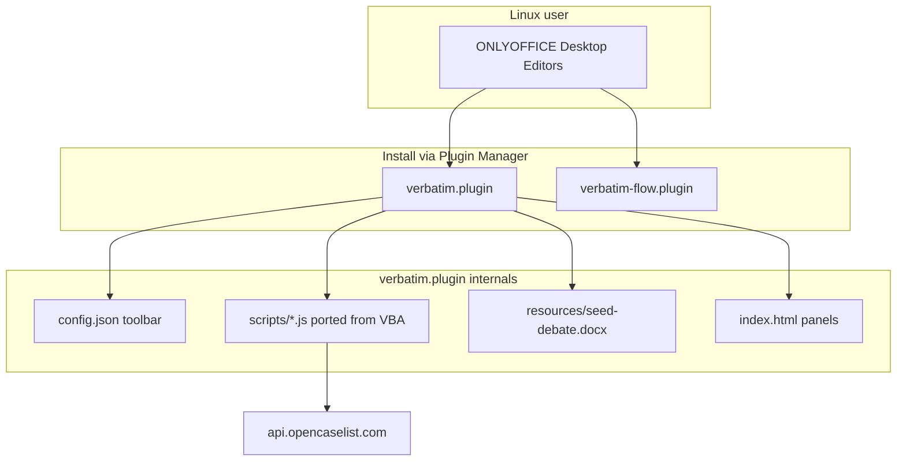
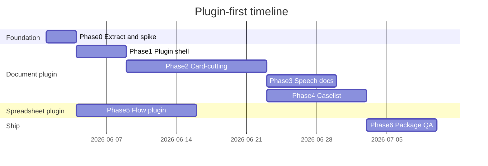

---

name: OnlyOffice Linux Port
overview: Replace Debate.dotm with a single ONLYOFFICE Desktop document plugin (JS port of desktop/src VBA), plus a companion spreadsheet plugin for Flow. No separate Word template install — the plugin is the product.
todos:

- id: recover-sources
content: Obtain Debate.dotm and Debate.xltm; extract customUI/customUI14.xml and word/styles.xml from .dotm as plugin spec
status: pending
- id: api-spike
content: Run ONLYOFFICE Linux API parity spike (styles bootstrap, character styles, outline levels, cross-doc speech insert)
status: pending
- id: scaffold-plugin
content: Create onlyoffice/verbatim/ plugin skeleton (config.json, index.html, scripts/, resources/)
status: pending
- id: vba-to-js-core
content: Port core VBA modules to JS — Formatting, Condense, Shrink, Strings, Globals, Settings
status: pending
- id: plugin-ui
content: Map customUI14.xml + Ribbon.bas to plugin toolbar; replace UserForms with plugin HTML panels
status: pending
- id: speech-doc
content: Port document-only Paperless.bas speech workflow into plugin
status: pending
- id: caselist
content: Port Caselist.bas + frmCaselist/frmLogin to plugin panel with openCaselist fetch API
status: pending
- id: flow-plugin
content: Build verbatim-flow spreadsheet plugin from flow/src VBA (no Flow-to-speech bridge)
status: pending
- id: package-qa
content: Package .plugin zips, Linux install script, docs, end-to-end QA
status: pending
isProject: false

---

# Verbatim → ONLYOFFICE Plugin Plan

## Goal

**Convert `Debate.dotm` into an ONLYOFFICE Desktop plugin** — not a separate `.dotx` template that users install alongside a plugin. The plugin replaces the Word template entirely:

- **Ribbon** (`customUI/customUI14.xml` inside `.dotm`) → plugin `config.json` toolbar
- **VBA callbacks** (`Ribbon.bas`, etc.) → plugin JavaScript using [Office API](https://api.onlyoffice.com/docs/office-api/get-started/overview/)
- **UserForms** (`frmCaselist`, `frmSettings`, …) → plugin HTML side panels
- **AutoOpen/Startup** → plugin `init` + document-open handlers
- **Styles** (Pocket/Hat/Block/Tag/Cite) → applied programmatically on “New Verbatim Doc”, or copied from a **bundled seed `.docx`** inside the plugin package (not a user-facing template install)

A **companion spreadsheet plugin** replaces `Debate.xltm` for Flow (same plugin model, different editor target).

---

## Context


| Today (Word)                              | Target (ONLYOFFICE)                                        |
| ----------------------------------------- | ---------------------------------------------------------- |
| `Debate.dotm` (VBA + ribbon XML + styles) | `verbatim.plugin` (single installable artifact)            |
| `Debate.xltm` (Excel Flow)                | `verbatim-flow.plugin`                                     |
| `desktop/src/*.bas` (Rubberduck export)   | **Spec for JS modules** — port 1:1 where practical         |
| `GetSetting` / registry                   | Plugin `localStorage` + `~/.config/verbatim/settings.json` |
| Caselist HTTP in VBA                      | `fetch()` in plugin (plugins can call external APIs)       |


**Scope (confirmed):**

- Card-cutting, speech docs (document-only), openCaselist, Flow
- Out of scope: Word↔Flow bridges, Flow→speech, VTub, Search, Quick Cards, OCR, Audio, USB/share helpers

**Sources available:**

- `[desktop/src/](desktop/src/)` — full VBA export including `[Caselist.bas](desktop/src/Caselist.bas)`
- `Debate.dotm` / `Debate.xltm` — needed to extract `customUI/customUI14.xml` and `word/styles.xml` (ribbon layout + style definitions)

---

## Architecture




### Repo layout

```
onlyoffice/
  verbatim/                     # Document plugin — replaces Debate.dotm
    config.json                 # Toolbar: Format, Speech, Caselist groups
    index.html                  # Side panels (settings, caselist wizard, speech picker)
    scripts/
      main.js                   # Plugin lifecycle (replaces Startup.bas)
      ribbon.js                 # Action router (replaces Ribbon.bas RibbonMain)
      formatting.js             # Formatting.bas
      condense.js               # Condense.bas
      shrink.js                 # Shrink.bas
      paperless.js              # Paperless.bas (speech subset only)
      caselist.js               # Caselist.bas
      http.js                   # HTTP.bas
      settings.js               # Settings.bas
      styles.js                 # Style bootstrap from seed doc or API
    resources/
      seed-debate.docx          # Optional: pre-styled empty doc bundled in plugin
    translations/
  verbatim-flow/                # Spreadsheet plugin — replaces Debate.xltm
    config.json
    scripts/
      flow.js, format.js, quickAnalytics.js, ...
  shared/                       # Shared constants, colors, JSON helpers
  scripts/
    build-plugin.sh             # Zip → .plugin
    install-linux.sh
  docs/
    linux-install.md
    vba-to-js-mapping.md        # Module correspondence table
```

### VBA → JS mapping strategy

Aligns with repo `[TODO.md](TODO.md)` (“create versions of all .bas files in js”):


| VBA module                                                      | JS file                     | Port?                                      |
| --------------------------------------------------------------- | --------------------------- | ------------------------------------------ |
| `Startup.bas`                                                   | `main.js`                   | Yes — init, new-doc handler                |
| `Ribbon.bas`                                                    | `ribbon.js` + `config.json` | Yes — map `RibbonMain` cases to button IDs |
| `Formatting.bas`                                                | `formatting.js`             | Yes                                        |
| `Condense.bas`                                                  | `condense.js`               | Yes                                        |
| `Shrink.bas`                                                    | `shrink.js`                 | Yes                                        |
| `Paperless.bas`                                                 | `paperless.js`              | Partial — speech doc only                  |
| `Caselist.bas`                                                  | `caselist.js`               | Yes                                        |
| `HTTP.bas`                                                      | `http.js`                   | Yes → `fetch`                              |
| `JSONTools.bas`                                                 | `shared/json.js`            | Yes → native JSON                          |
| `Settings.bas`                                                  | `settings.js`               | Partial — minimal panel                    |
| `Globals.bas`                                                   | `shared/globals.js`         | Yes                                        |
| `Strings.bas`                                                   | `shared/strings.js`         | Yes                                        |
| `Flow.bas` (Word)                                               | —                           | No — Word→Excel bridge                     |
| `VirtualTub`, `Search`, `QuickCards`, `OCR`, `Audio`, `Plugins` | —                           | No                                         |
| UserForms (`frmCaselist`, `frmLogin`, …)                        | `index.html` + panel JS     | Yes — HTML replaces forms                  |


**Ribbon XML workflow:** Unzip `Debate.dotm` → read `customUI/customUI14.xml` → each `<button id="..." onAction="RibbonMain"/>` becomes a `config.json` entry whose `click` handler calls the matching function in `ribbon.js` (same dispatch pattern as `[Ribbon.bas](desktop/src/Ribbon.bas)` `Select Case c.Id`).

---

## Phase 0 — Prerequisites (2–3 days)

### 0.1 Extract spec from `Debate.dotm`

1. Unzip `Debate.dotm` → save `customUI/customUI14.xml` and `word/styles.xml` into `onlyoffice/docs/reference/` (reference only, not shipped separately).
2. Use styles.xml to define style bootstrap logic in `styles.js`.
3. Use customUI14.xml as the authoritative list of toolbar buttons to implement in `config.json`.

`Caselist.bas` is already in `[desktop/src/](desktop/src/)` — no re-export needed.

### 0.2 API parity spike (blocking)

Validate on ONLYOFFICE Desktop Linux before bulk porting:


| Feature                              | VBA source                     | Spike question                                                              |
| ------------------------------------ | ------------------------------ | --------------------------------------------------------------------------- |
| Create styles on new doc             | `Startup.bas`                  | Can plugin create Pocket/Hat/Block/Tag via API, or must copy from seed doc? |
| Character styles (Cite, Underline)   | `Formatting.bas`               | Supported or fallback to run formatting?                                    |
| Outline levels                       | `Condense.bas`, `Shrink.bas`   | `GetOutlineLevel()` equivalent?                                             |
| Insert content into another open doc | `Paperless.bas`                | Cross-document speech insert from plugin?                                   |
| Selection-changed events             | `Formatting.bas` UnderlineMode | Replace VBA `DoEvents` loop with plugin event                               |


Document results in `onlyoffice/docs/api-parity.md`.

### 0.3 Dev setup

- ONLYOFFICE Desktop 9.x+ on Linux, plugins enabled
- Dev install: `Asc.editor.installDeveloperPlugin("http://localhost:PORT/config.json")`
- Hot-reload via Plugin Manager during development

---

## Phase 1 — Plugin shell + style bootstrap (3–5 days)

Build the empty plugin that **is** Verbatim, before porting all macros.

### 1.1 Plugin skeleton

- `config.json`: plugin metadata, **Debate** tab with placeholder buttons (Format / Speech / Caselist groups)
- `index.html`: empty side panel shell
- `main.js`: `init`, `button`, `onDocumentContentReady` handlers

### 1.2 “New Verbatim Document” action

Replaces opening `Debate.dotm` as a template:

**Option A (preferred if spike passes):** Plugin button creates blank doc → `styles.js` programmatically defines all Verbatim styles.

**Option B (fallback):** Plugin loads `resources/seed-debate.docx` (bundled, styles pre-baked) and inserts/copies style definitions into the active document.

Also port from `Startup.bas`:

- Enable navigation/outline pane if API supports it
- Set default view

### 1.3 Settings storage

Replace `GetSetting`/`SaveSetting` with `settings.js` reading/writing `~/.config/verbatim/settings.json` (profile name, format prefs, active speech doc path, caselist token).

**Deliverable:** Installable `verbatim.plugin` that creates a properly styled Verbatim document from a toolbar button.

---

## Phase 2 — Core card-cutting (2 weeks)

Port VBA → JS using `callCommand` / Office API inside plugin button handlers.


| Plugin button                 | VBA source             | JS function              |
| ----------------------------- | ---------------------- | ------------------------ |
| Paste Text                    | `Formatting.PasteText` | `formatting.pasteText()` |
| Condense                      | `Condense.`*           | `condense.*`             |
| Shrink / Unshrink             | `Shrink.*`             | `shrink.*`               |
| Underline / Highlight / Clear | `Formatting.*`         | `formatting.*`           |
| Cite tools                    | `Formatting.*`         | `formatting.*`           |
| Style promotion (Pocket→Tag)  | `Formatting.*`         | `formatting.*`           |


Work module-by-module: port logic from `.bas`, strip `#If Mac` branches, replace `Selection`/`Range` with Office API equivalents.

**Defer:** `SynonymInfo` auto-underline (manual toggle only in v1).

---

## Phase 3 — Speech docs (1 week)

Port document-only subset of `[Paperless.bas](desktop/src/Paperless.bas)` into `paperless.js` + speech panel in `index.html`:


| Action                      | VBA                 | Plugin                                                          |
| --------------------------- | ------------------- | --------------------------------------------------------------- |
| New Speech                  | `NewSpeech`         | Create doc via seed/styles bootstrap, set `activeSpeechDocPath` |
| Set Active Speech           | implicit            | Panel dropdown of open docs                                     |
| Send to Speech (cursor/end) | `SendToSpeech`*     | Copy selected paragraphs → insert in active speech doc          |
| Move Up / Down              | `MoveUp`/`MoveDown` | Reorder blocks in speech doc                                    |


State: `activeSpeechDocPath` in settings JSON; validate doc still open before send.

---

## Phase 4 — openCaselist (1–2 weeks)

Port `[Caselist.bas](desktop/src/Caselist.bas)` + forms to plugin panel (not embedded macros — needs `fetch`).


| Ribbon action   | VBA                          | Plugin panel                                  |
| --------------- | ---------------------------- | --------------------------------------------- |
| Caselist Wizard | `UI.ShowForm "Caselist"`     | Open caselist panel                           |
| Upload          | `frmCaselist` upload flow    | HTML wizard: caselist → school → team → round |
| Login           | `frmLogin`                   | Tabroom login → store token                   |
| Word2Markdown   | `Caselist.Word2MarkdownMain` | `caselist.js`                                 |
| Cite Request    | `Caselist.CiteRequest*`      | Toolbar buttons                               |


API: `https://api.opencaselist.com/v1` (`[Globals.bas](desktop/src/Globals.bas)`).

Port `[HTTP.bas](desktop/src/HTTP.bas)` cookie auth → `fetch` with `caselist_token` header.

---

## Phase 5 — Flow spreadsheet plugin (1–2 weeks)

Separate `**verbatim-flow.plugin`** targeting the spreadsheet editor (ONLYOFFICE plugins declare editor type in `config.json`).

Port from `[desktop/flow/src/](desktop/flow/src/)`:


| Include                          | Source               |
| -------------------------------- | -------------------- |
| Add Aff/Neg/CX sheets            | `Format.bas`         |
| Row/cell insert, merge, move     | `Flow.bas`           |
| Insert mode toggle               | `Flow.bas`           |
| Highlight/evidence/group toggles | `Flow.bas`           |
| Quick Analytics                  | `QuickAnalytics.bas` |
| Switch speech menu               | `UI.bas`             |


| Exclude         | Source                   |
| --------------- | ------------------------ |
| Flow→speech     | `Speech.bas`             |
| Split with Word | `UI.bas` `SplitWithWord` |


“New Flow” button in plugin creates a formatted workbook (like “New Verbatim Document” — no separate `.xlsx` install).

Shared Flow settings use same `~/.config/verbatim/settings.json`.

---

## Phase 6 — Package, docs, QA (1 week)

### Artifacts

- `verbatim.plugin` — document editor plugin (the Debate.dotm replacement)
- `verbatim-flow.plugin` — spreadsheet plugin
- `onlyoffice/scripts/install-linux.sh` — copy `.plugin` files to ONLYOFFICE plugin directory

### User workflow (no template install)

1. Install ONLYOFFICE Desktop on Linux
2. Install `verbatim.plugin` via Plugin Manager
3. Open Document Editor → **Plugins → Verbatim → New Verbatim Document**
4. Card-cut using plugin toolbar; speech/caselist via plugin panels
5. Optionally install `verbatim-flow.plugin` for flowing

### QA checklist

- New Verbatim doc → styles correct (Pocket/Hat/Block/Tag hierarchy)
- Paste → condense → shrink → cite on Linux
- New speech doc → send cards → reorder
- Login → upload to openCaselist → cite request
- New Flow → add Aff/Neg sheets → in-round editing

---

## Risk register


| Risk                                      | Mitigation                                                                   |
| ----------------------------------------- | ---------------------------------------------------------------------------- |
| Character styles unsupported              | Spike early; use run-level bold/underline/highlight as fallback              |
| Cross-doc speech insert blocked           | MVP: send-to-end only; fallback: copy to clipboard + open speech doc prompt  |
| Large VBA surface (~15 modules)           | Strict scope; port module-by-module with mapping table                       |
| Plugin can't replicate all ribbon buttons | Prioritize Format + Speech + Caselist groups from customUI14.xml; defer rest |
| Flow is different editor                  | Separate plugin is required by ONLYOFFICE architecture                       |


---

## Timeline




Phases 2–4 are sequential inside the document plugin. Phase 5 (Flow) can run in parallel after Phase 0.

**Estimate:** ~7–9 weeks solo; ~5 weeks with parallel Flow work.

---

## What you do NOT port

- `Debate.dotm` / `.dotx` as a user-facing install artifact
- Word→Flow bridge (`[desktop/src/Flow.bas](desktop/src/Flow.bas)`)
- Flow→speech (`[desktop/flow/src/Speech.bas](desktop/flow/src/Speech.bas)`)
- VTub, Search, QuickCards, OCR, Audio, PC AHK plugins
- Full Settings form — minimal plugin settings panel only
- Mac/PC `#If` branches in VBA

---

## First steps (when ready to implement)

1. Unzip `Debate.dotm` → extract `customUI14.xml` + `styles.xml` to `onlyoffice/docs/reference/`.
2. Scaffold `onlyoffice/verbatim/` plugin with `config.json` + `main.js`.
3. API spike: style bootstrap + one formatting action (`PasteText`).
4. Implement “New Verbatim Document” button (plugin replaces template open).
5. Port `Formatting.bas` → `formatting.js` as vertical slice.
6. Parallel: scaffold `onlyoffice/verbatim-flow/` with “New Flow” button.

